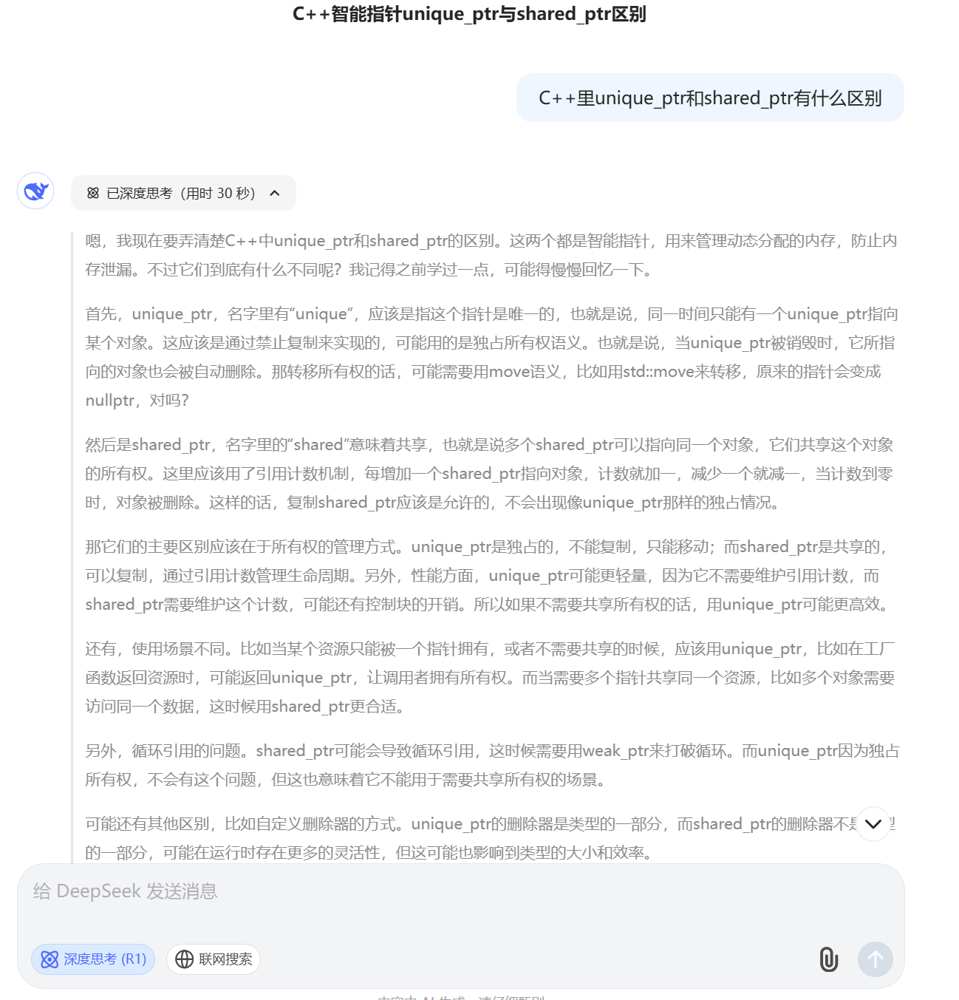
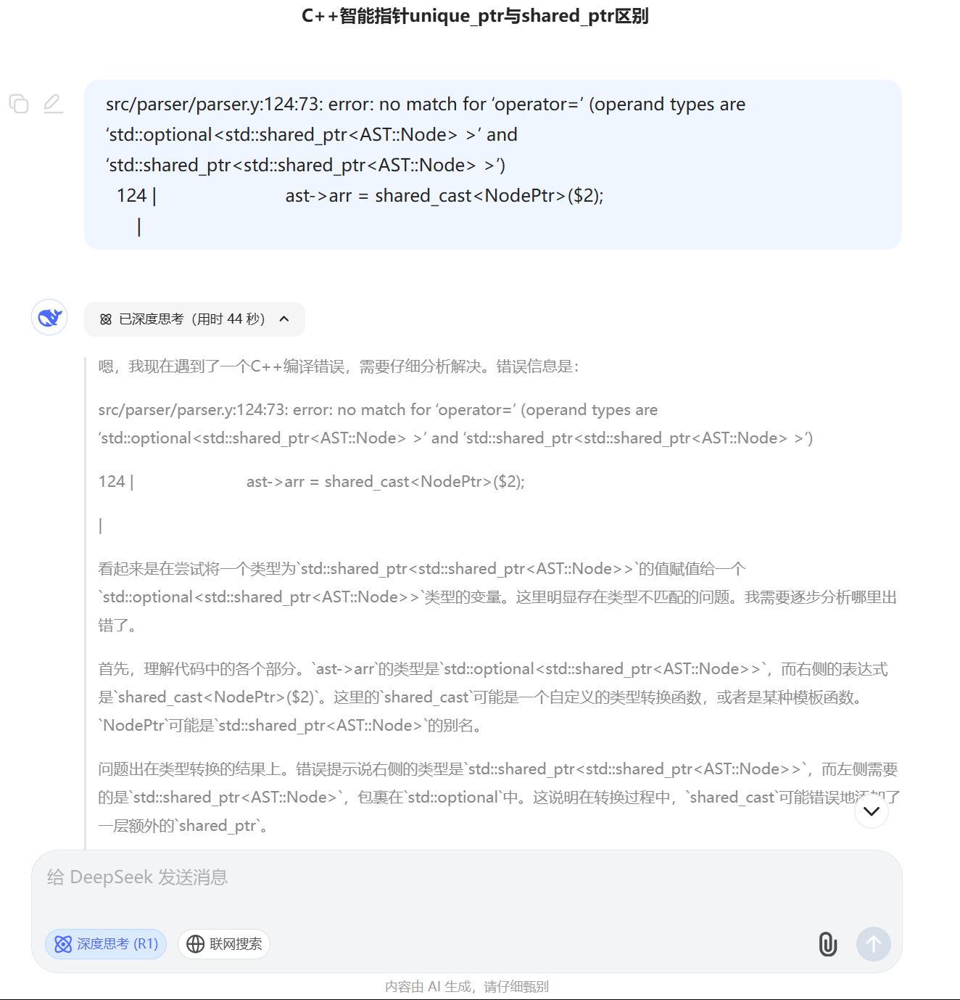

### 程序实现的功能

程序实现了 SysY 语言的**词法分析**和**语法分析**功能，具体包括：

1. **词法分析**：
    
    - 识别关键字（`int`, `void`, `return`, `if`, `while` 等）、运算符（`+`, `-`, `*`, `/`, `&&`, `||` 等）和界限符（`()`, `{}`, `[]` 等）。
    - 支持整数常量（十进制、八进制、十六进制）和标识符。
    - 跳过空白符和注释（单行注释 `//` 和多行注释 `/* */`）。
    - 错误处理：对非法字符抛出异常并提示行号。
        
2. **语法分析**：
    
    - 解析程序结构：支持编译单元（`CompUnit`）包含多个函数定义和全局变量声明。    
    - 函数定义：支持带参数的函数声明（如 `int func(int a, int b[])`）和空参数列表。
    - 变量声明：支持普通变量和数组的声明与初始化（如 `int arr[2][3] = {{1,2}, {3}}`）。
    - 控制流语句：解析 `if-else`、`while` 和 `return` 语句。
    - 表达式：支持多级运算符优先级（如加减乘除、逻辑运算）和函数调用（如 `foo(1, a+2)`）。
    - 空语句：支持空语句 `;` 

在此基础上，还构建了相应的AST作为语法结构的AST节点，如 `FuncDef`、`VarDecl`、`BinaryExp` 等。

在节点管理上，通过 `std::shared_ptr` 管理节点内存，避免内存泄漏。
        
支持语法树的可视化打印（通过 `print_tree` 方法输出树形结构）。

### 亮点

1. `InitVal`：数组变量的初值和非数组变量的初值用了同一个AST结构，`InitVal` 中使用`{cpp icon}|std::vector<NodePtr> args;` 来保存初值，对于非数组变量来说，`args` 中存储一个`BinaryExpPtr`，对于数组变量来说，`args` 中存储一个`InitValPtr`，它指向的`InitVal`结构中存储了各个子集的初值。e.g. 有一个数组变量的初值写作`{{1,2},{3,4}}`，那么
```cpp 
fatherptr->args = {sonptr1, sonptr2};
sonptr1->args = {InitValPtr(1), InitValPtr(2)};
sonptr2->args = {InitValPtr(3), InitValPtr(4)};
```

2. 在变量定义中，由于初值可以存在也可以不存在，所以`InitVal`应该是可选择的，所以我调用了`<optional>`库，在`ValDef`和`ArrDef`中，`{cpp icon}|std::optional<NodePtr> val;` 将`val`的类型设为可选的，通过`val.has_value()`进行输出判断。
3. 在`tree.hpp`中AST结构体定义时，结构体的属性大多使用`NodePtr`来定义方便不同类型节点的储存，但在一些子节点类型统一，比如`ArrLists`（数组定义时的后缀）、`ArrDecl`、`VarDecl`、`FuncFParams`等等，则使用了比较精准的类型定义，保证了在出现类型错误时会自动报错，出现语法错误。
4. 在If-else条件语句中，利用构造函数参数的个数来判断是否有else语句，两个参数即返回没有else语句的构造函数 `{cpp icon} IfStmt(NodePtr cond, NodePtr stmt) : cond(cond), stmt(stmt), else_stmt(nullptr) {}` ，三个参数即返回有else语句的构造函数  `{cpp icon}IfStmt(NodePtr cond, NodePtr stmt, NodePtr else_stmt) : cond(cond), stmt(stmt), else_stmt(else_stmt) {}` 。在返回子节点的`get_children()`函数中，利用 `else_stmt`是否为 `nullptr`来判断返回值。
```cpp
return else_stmt ? std::vector<NodePtr>{cond, stmt, else_stmt} : std::vector<NodePtr>{cond, stmt};
```

### Declare
在最开始写实验时对语法不太了解，C++的许多东西也有所遗忘，利用Deepseek复习了相关知识。



在写了一部分代码后进行编译，出现了编译错误，利用Deepseek进行了报错调试。



这是我的AI使用和代码借鉴部分。